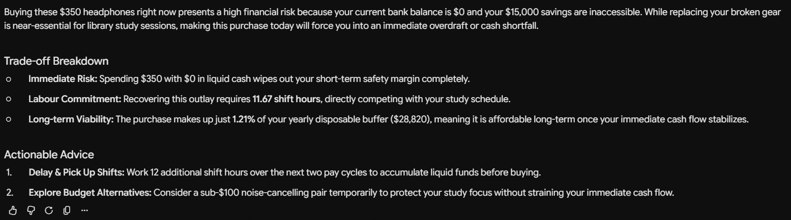
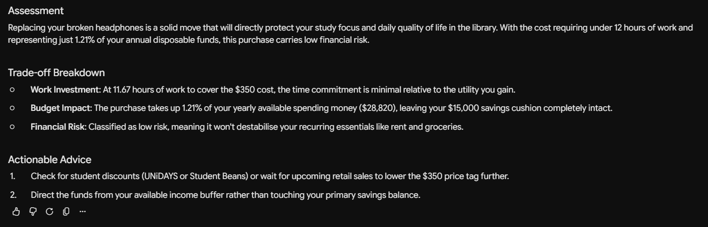
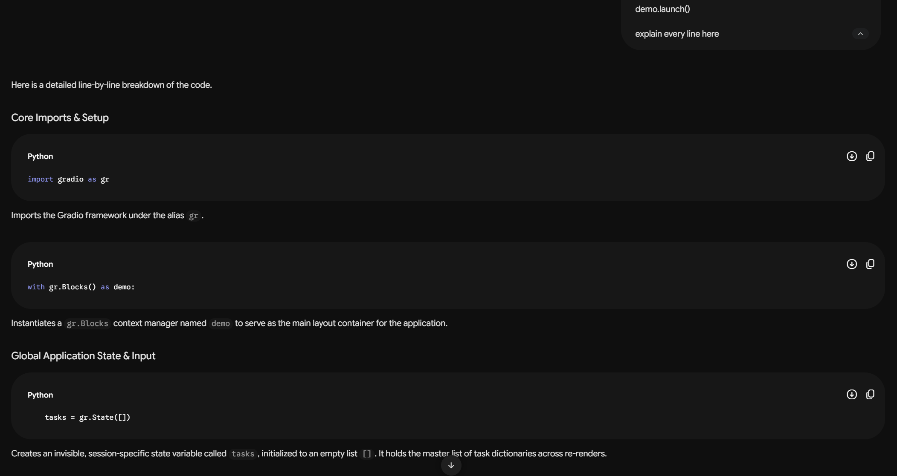
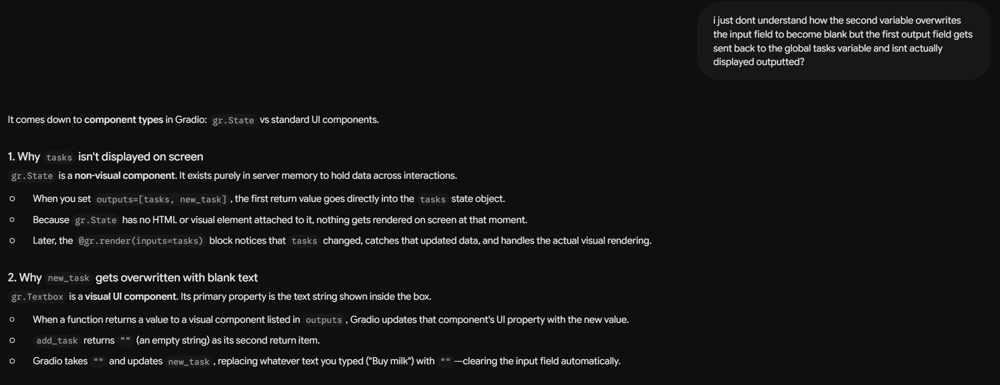
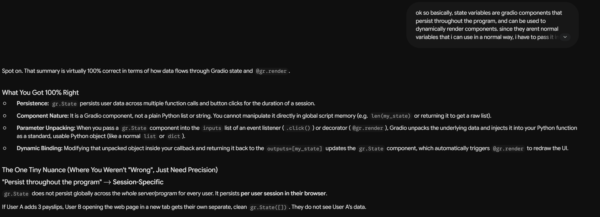
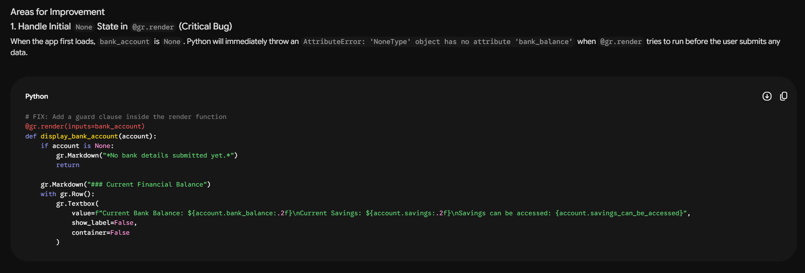

# Developer Diary

## Entry 1: 21 September - 28 September
This week was the first week of work for this assignment. To make sure that I didn't waste time iterating for no reason while coding, I made sure my planning was well constructed in advance. Which is why I spent the entire week focusing purely on the 4 steps of the planning stage. These steps being - `Understanding The Problem`, `Identifying the Inputs & Outputs`, `Worked Example`, and `Pseudocode`.

For the first step, since this assignment has no set objective to complete, I thought hard about what I wanted to create. I wanted to make something that isn't just a simple currency converter or spending-category summariser. I wanted to make something that I would actually use. Which is when I realised that I have actually used Gemini in the past to inform me on what the best car for me was based on my finances and my goals for the future. That chat itself had a lot of variables and had complex factors to take into account, which would be too hard to integrate into a Python application like this for me at my skill level. So I made a simpler generic version which accomplishes the same goal. The program allows users to see if a purchase is financially feasible for them based on their income and the expenses they have.

After defining what I wanted the program to do, I moved onto defining what the user is meant to do and see. Here is also where I got stuck on how I should format the notebook file. I wondered whether having all my planning at the start is the best, or having text blocks with each of the 3 sections before it's respective code block is better. I decided to go with the first one as it feels more concise and tidy. Reading through all of it gives both me and anyone else reading this file an easy glimpse into how this program works from start to finsish, without having to scroll through the entire notebook.

Moving onto the worked example and the pseudocode, I heavily underestimated how long it would take me to iron out everything I wanted to do. Initially, I thought it would take a day to get through it all as it should be a simple enough program to create. However, after going through the worked example with the current variables I made, I realised that I would need to change things around. Some things include me not factoring in people's savings and current bank balances, and whether someone would even want their savings accessed for non-essential purchases. Which then tied into me not properly calculating the risk_tier of the purchase, as I wasn't considering their current bank balance and was only looking at how much money they would make at the end of the year if they maintained their average income. There were other stuff I also had to iterate over heavily, and it made me happy to see that this planning stage truly was very useful.

Parts of the pseudocode and overall planning may not directly align with the code that I create, and that is mainly because I created this planning with the intention of it being an overview of the logic of the program, and not a super in-depth breakdown of the program. So even though I have planned all of the functions, there are still things I am going to change that I may not include in the pseudocode. For example, parts of the program may not translate 1:1 into the Python version, like how I say:
> ITERATE through payslip:
>
> IF payslip.wage_time_frame EQUALS 'week':
>
This technically doesn't make sense if converted to Python, as `payslip` is an array and doesn't have a wage_time_frame field. But it still gives me 95% of what I need, and I understand what it's actually trying to say.
Additionally, my pseudocode is written from the point of view of it being a terminal program. Despite it being a Gradio program, since I don't know Gradio at this point, I just wanted to make it more terminal based as that makes sense to me and I can see what may need to be validated and what the flow of the program is.

Regarding AI usage this week. I only used Gemini when seeing what my output would look like with my custom prompt. I used the same prompt twice, but chanced the value of `savings_can_be_accessed` to true and false. For other parts of the program, I didn't need AI as I already knew exactly what I wanted this program to be, and I didn't need AI to tell me how it should work. I will most likely use it more next week when I get into the actual coding part.

**This is what Gemini gave me this week:**
- When I put poor financial information into the prompt, it said this:

- When I put good financial information into the prompt, it said this:

I think that this response is pretty good, as it is concise, isn't hallucinating information, and analyses the situation. Although I may change it in the future anyways.

 

---

 

## Entry 1: 28 September - 04 October
This week I actually started working on my code. I used the pseudocode I had made last week as a guide as to what I wanted to build, and because of that, it was very easy to get started.

Since Gradio is an actual display with pre-defined components, and isn't the normal terminal that I am used to, my pseudocode wasn't a 1 to 1 match, but it gave me what I needed to know.
To get started, I looked up Gradio documentation, as I didn't want to rely on AI immediately. Initially I used the [quickstart guide](https://gradio.app/guides/quickstart), however when I tried to make the program more complex, I didn't know what to do and how to use Gradio to achieve what I wanted. Still reluctant to run to AI, I came across this this website which showed how to put together more [complex components](https://gradio.app/guides/dynamic-apps-with-render-decorator#putting-it-together). When play-testing on the website, I could see that this is the exact functionality I wanted, however I didn't understand any of the code and how to make it mine. This is where I then went to Gemini.

I pasted the code into Gemini and asked it to explain each line of the code and how it worked.

This allowed me to actually see how the program functions and how I can use it.

However, since I'm new to Gradio, I still didn't understand much about the code. So I would ask Gemini for further clarification on how things worked

And when I begun to get the handle on things, I gave it my own explanation of how the code works, to see if I truly do understand it.

This provided reinforced learning and allowed me to be fully confident that I can work through the program.

I didn't ask it to write any of the code for me as I didn't need to. Once it explained to me how the code worked, I was able to make my own code. After finishing it, I then verified with it that everything was working. I asked it to go through my code and give me a summary of what I did well, and what I need to improve on.
An example of something it told me to improve on, was it telling me to add a guard at the start of the code.

Despite it being probably being correct, I haven't experienced any issues with my current setup, so I have no reason to change it to what it's telling me. I also purposefully made the object null so that it would render an empty space. However, if in the future I hate the design I made, I may add the guard to have it display a message.

All in all, Gemini has been very helpful this week in explaining the code, and has fully enabled me to write my own code rather than rely on it for everything.